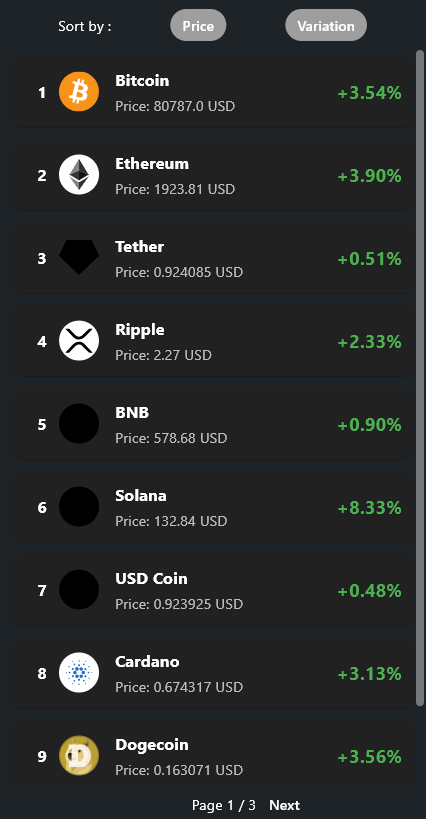

# 💰 flutter_mini_app_crypto

A mini Flutter app to visualize cryptocurrency data, using a mocked backend via `json-server`.

---

## ⚙️ Prerequisites

Make sure you have the following installed:

- [Flutter](https://docs.flutter.dev/get-started/install)
- [Node.js](https://nodejs.org/)
- `json-server` (if not already installed)

---

## 🚀 Installation

### 1. Install `json-server` (if necessary)

```bash
npm install -g json-server
```

### 2. Start the mock JSON server

From the folder containing `data.json`:

```bash
json-server data.json
```

This will start a mock server at `http://localhost:3000`.

### 3. Run the Flutter application

Navigate to the project folder:

```bash
cd miniapp_crypto_deskoin
flutter run
```

---

## 🧪 Note

Make sure the URL in your Flutter code points to `http://localhost:3000` or use your local IP address if testing on a physical device.

---

## 📁 Project Structure

```
.
├── data.json                # Mock data for json-server
└── miniapp_crypto_deskoin  # Flutter project
```


